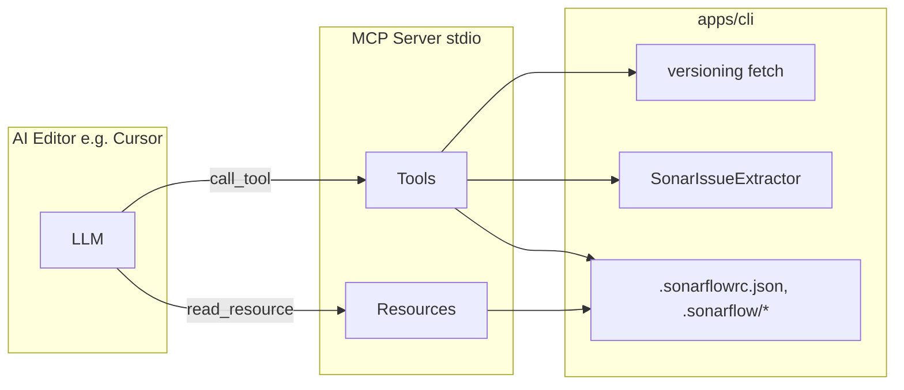

# Sonarflow MCP Server for AI Editors

## Context

The [apps/cli](apps/cli/) provides:

- **init**: Interactive setup for `.sonarflowrc.json`, npm scripts, AI editor rules (Cursor/VSCode/Windsurf).
- **fetch**: Detects branch/PR (GitHub/Bitbucket), fetches Sonar issues, measures, security hotspots, quality gate; writes `.sonarflow/issues.json`, `measures.json`, `security-hotspots.json`, `quality-gate.json`.
- **update**: Check for CLI updates.

The repo previously had an MCP server (see CHANGELOG) that was removed. The goal is to (re-)introduce an MCP server that exposes **tools** (and optionally **resources**) so LLMs in AI editors can use Sonarflow without running shell commands blindly.

## Architecture

- **Placement**: Implement the MCP server **inside [apps/cli*](apps/cli/)*: new `src/mcp/` directory and a new CLI command `sonarflow mcp` that starts the server (stdio). One package to install; Cursor can run `npx sonarflow mcp` (or path to `dist/mcp.js`) as the MCP server command.
- **SDK**: Use official [Model Context Protocol TypeScript SDK](https://github.com/modelcontextprotocol/typescript-sdk) (`@modelcontextprotocol/sdk`) with `zod` (already in [apps/cli/package.json](apps/cli/package.json)). Transport: stdio for local AI editor integration.
- **Working directory**: All tools resolve paths from `process.cwd()` (project root where the editor is opened), consistent with the existing CLI.

## Proposed Tools

| Tool                             | Purpose                                                            | Key arguments                                            | Use case for LLM                                                      |
| -------------------------------- | ------------------------------------------------------------------ | -------------------------------------------------------- | --------------------------------------------------------------------- |
| **sonarflow_fetch**              | Run the same fetch as `sonarflow fetch` and return a short summary | `branch?`, `sonarPrLink?`, `verbose?`                    | Refresh Sonar data, then use other tools to read issues and fix them. |
| **sonarflow_get_issues**         | Read `.sonarflow/issues.json` with optional filters                | `severity?`, `component?` (file path), `rule?`, `limit?` | Get list of issues to fix; filter by file or severity.                |
| **sonarflow_get_issues_by_file** | Same data grouped by file (component)                              | `limit?`                                                 | "Fix all issues in this file" workflow.                               |
| **sonarflow_get_quality_gate**   | Read `.sonarflow/quality-gate.json`                                | —                                                        | Know if quality gate passed/failed and why.                           |
| **sonarflow_get_measures**       | Read key metrics from `.sonarflow/measures.json`                   | `metricKeys?` (optional filter)                          | Coverage, duplication, violations counts.                             |
| **sonarflow_get_config**         | Read and validate `.sonarflowrc.json`                              | —                                                        | Get `rulePath`, `outputPath`, `sonarProjectKey`, etc.                 |
| **sonarflow_get_autofix_rule**   | Read the autofix rule file from `rulePath` in config               | —                                                        | Load sonarflow-autofix rule content for fixing issues.                |
| **sonarflow_check_setup**        | Check if project is initialized and has fetched data               | —                                                        | Decide whether to suggest `sonarflow init` or `sonarflow fetch`.      |

All read tools should return JSON or clear error messages (e.g. "Config not found. Run `sonarflow init`.").

## Optional: Resources and Prompts

- **Resources** (read-only URIs the AI can open):
  - `sonarflow://project/issues` → content of `.sonarflow/issues.json` (or from config `outputPath`).
  - `sonarflow://project/config` → content of `.sonarflowrc.json`.
- **Prompts** (optional):
  - e.g. "Fix Sonar issues" that expands to a template referencing current issues and rule path (could list resource URIs).

These can be added in a follow-up if you want the AI to "open" Sonarflow data as documents.

## Implementation Plan

1. **Dependencies**
  In [apps/cli/package.json](apps/cli/package.json): add `@modelcontextprotocol/sdk` (and keep `zod`).
2. **MCP server entry and CLI command**
  - Add `src/mcp/server.ts`: create MCP server with StdioServerTransport, register all tools (and optionally resources/prompts).  
  - Tool handlers:  
    - Resolve paths from `process.cwd()` and existing config (`outputPath` from `.sonarflowrc.json` or default `.sonarflow/`).  
    - For **sonarflow_fetch**: call the existing `fetchSonarIssues` from [apps/cli/src/packages/versioning/index.ts](apps/cli/src/packages/versioning/index.ts) (same as `sonarflow fetch`); return a short summary (e.g. issue count, quality gate status, paths to saved files).  
    - For read tools: use `fs.readFileSync` / `fs.existsSync` on `.sonarflowrc.json` and `.sonarflow/*.json`; parse and filter/aggregate as needed.
  - In [apps/cli/src/cli.ts](apps/cli/src/cli.ts): add a `mcp` command that runs `src/mcp/server.js` (or the compiled entry) with stdio, so that `sonarflow mcp` starts the MCP server.
3. **Build**
  Ensure the build (e.g. `tsgo` or current TS build) compiles `src/mcp/server.ts` and that the `mcp` command invokes the correct output file (e.g. `dist/mcp.js`).
4. **Documentation**
  - In [apps/cli/README.md](apps/cli/README.md): add an "MCP Server" section: how to run (`npx sonarflow mcp`), how to add to Cursor (example MCP config with command and args), and list of tools with one-line descriptions.  
  - Optionally add a short `apps/cli/docs/MCP.md` with tool arguments and example Cursor config.
5. **Cursor MCP config example**
  Provide a snippet for Cursor’s MCP settings (e.g. in README or MCP.md) so users can paste and point to `npx sonarflow mcp` or `node /path/to/apps/cli/dist/mcp.js`.

## File Summary

| Path                                                     | Action                                                                                                             |
| -------------------------------------------------------- | ------------------------------------------------------------------------------------------------------------------ |
| [apps/cli/package.json](apps/cli/package.json)           | Add `@modelcontextprotocol/sdk` dependency; add script `mcp` if useful (e.g. `bun run src/mcp/server.ts` for dev). |
| [apps/cli/src/cli.ts](apps/cli/src/cli.ts)               | Add `program.command("mcp")` that spawns the MCP server entry (stdio).                                             |
| [apps/cli/src/mcp/server.ts](apps/cli/src/mcp/server.ts) | **New.** MCP server: StdioServerTransport, register 8 tools (and optionally 2 resources + 1 prompt).               |
| [apps/cli/README.md](apps/cli/README.md)                 | Document MCP: command, Cursor config example, tool list.                                                           |
| [apps/cli/tsconfig.json](apps/cli/tsconfig.json)         | Ensure `src/mcp/`** is included in compilation.                                                                    |

## Design Notes

- **No init in MCP**: Init stays interactive (prompts); the MCP only exposes **sonarflow_check_setup** so the AI can suggest running `sonarflow init` in the terminal.  
- **Env and config**: Fetch and Sonar logic already use `process.env` and `.sonarflowrc.json`; the MCP runs in the same process as the CLI, so no extra env handling is required beyond the existing dotenv in CLI.  
- **Reuse**: Maximize reuse of `loadConfiguration`, `fetchSonarIssues`, and `SonarIssueExtractor` from the existing CLI so the MCP stays a thin layer over current behavior.

